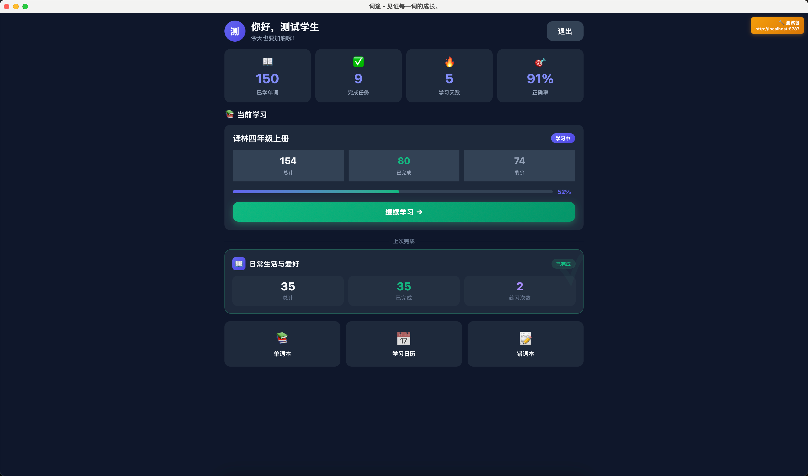
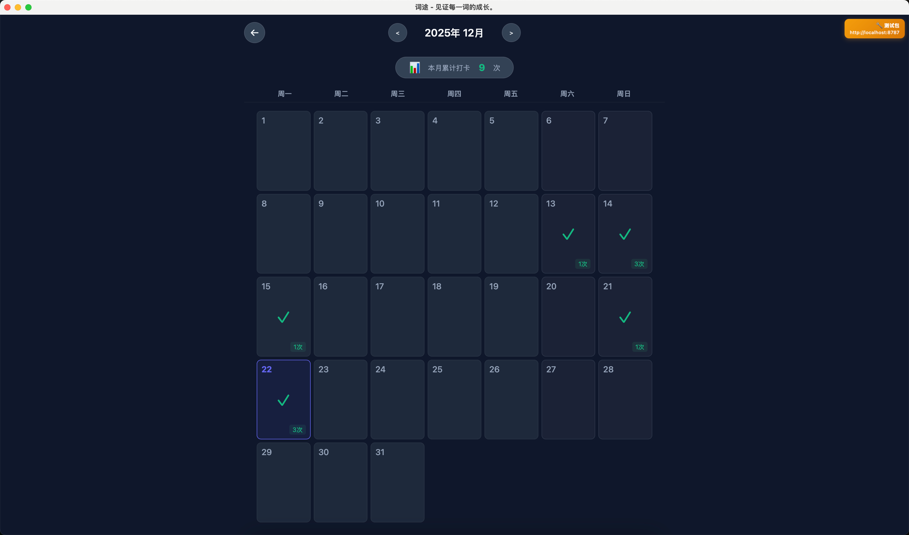
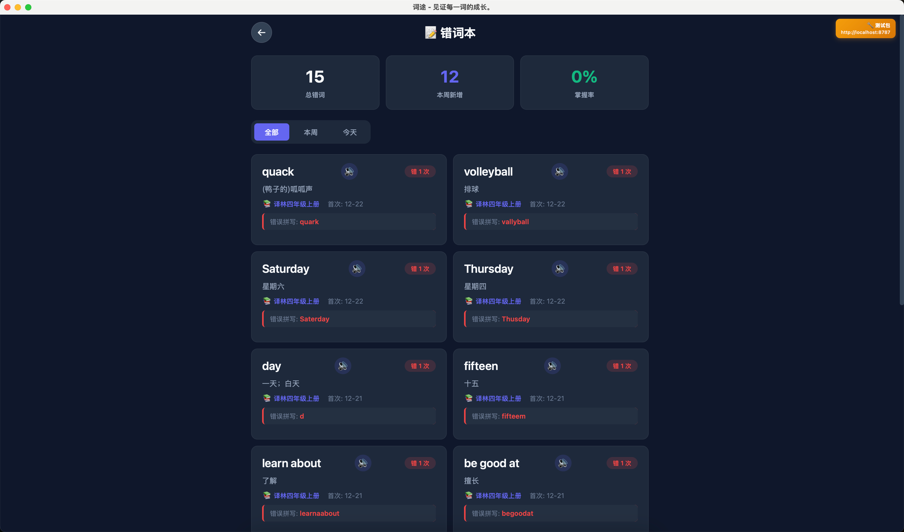

# Citour (词途) - 英语单词打卡应用

一个多租户英语单词学习系统，支持系统管理、租户管理和学生练习三个层级。

## 学生端截图

| 模块 | 截图 |
| --- | --- |
| 登录 |  |
| 首页 |  |
| 单词本 |  |
| 学习日历 |  |
| 错词本 |  |
| 打卡练习1 |  |
| 打卡练习2 |  |
| 打卡练习3 |  |
| 打卡练习4 |  |


## 系统架构

```
┌─────────────────────────────────────────────────────────────┐
│                        客户端                               │
│  ┌──────────────┐  ┌─────────────────────────────────┐      │
│  │ apps/admin   │  │ apps/desktop                    │      │
│  │ (管理后台)   │  │ (学生端 Web + 桌面)             │      │
│  │ React+AntD   │  │ Tauri + React                   │      │
│  │ :5173        │  │ :5175 (Web) / 桌面应用          │      │
│  └──────────────┘  └─────────────────────────────────┘      │
│          │                       │                           │
│          └───────────────────────┘                           │
│                      │                                       │
│                      ↓                                       │
│  ┌──────────────────────────────────────────────────────┐   │
│  │              apps/api (后端 API)                      │   │
│  │              Cloudflare Workers + Hono                │   │
│  │              :8787                                    │   │
│  └──────────────────────────────────────────────────────┘   │
│                             │                                │
│                             ↓                                │
│  ┌──────────────────────────────────────────────────────┐   │
│  │              Cloudflare D1 (SQLite)                   │   │
│  └──────────────────────────────────────────────────────┘   │
└─────────────────────────────────────────────────────────────┘
```

## 技术栈

| 组件 | 技术 | 端口 |
|------|------|------|
| 后端 API | Cloudflare Workers + Hono | 8787 |
| 数据库 | Cloudflare D1 (SQLite) | - |
| 管理后台 | React + Ant Design Pro | 5173 |
| 学生端 (Web/桌面) | Tauri + React | 5175 (Web) / 桌面应用 |

## 项目结构

```
Citour/
├── apps/
│   ├── api/                  # 后端 API
│   │   ├── src/
│   │   │   ├── index.ts      # 服务入口
│   │   │   ├── routes/       # API 路由
│   │   │   │   ├── auth.ts       # 认证
│   │   │   │   ├── plans.ts      # 学习计划
│   │   │   │   ├── tasks.ts      # 学习任务
│   │   │   │   ├── practice.ts   # 练习提交
│   │   │   │   ├── wordbooks.ts  # 单词本
│   │   │   │   ├── words.ts      # 单词
│   │   │   │   ├── students.ts   # 学生管理
│   │   │   │   ├── calendar.ts   # 学习日历
│   │   │   │   ├── sys.ts        # 系统管理
│   │   │   │   └── dashboard.ts  # 统计
│   │   │   └── middleware/   # 中间件
│   │   ├── schema.sql        # 数据库 Schema
│   │   └── wrangler.toml     # Wrangler 配置
│   │
│   ├── admin/                # 管理后台
│   │   ├── src/
│   │   │   ├── pages/        # 页面组件
│   │   │   │   ├── sys/      # 系统管理页面
│   │   │   │   └── tenant/   # 租户管理页面
│   │   │   ├── components/   # 公共组件
│   │   │   └── services/     # API 服务
│   │   └── package.json
│   │
│   └── desktop/              # 学生端 (Web + 桌面)
│       ├── src/
│       │   ├── pages/        # 页面组件
│       │   │   ├── Home.jsx           # 首页
│       │   │   ├── Books.jsx          # 单词本
│       │   │   ├── Practice.jsx       # 练习
│       │   │   ├── Stats.jsx          # 统计
│       │   │   ├── StudyCalendar.jsx  # 学习日历
│       │   │   ├── Wrong.jsx          # 错词本
│       │   │   └── Login.jsx          # 登录
│       │   ├── styles/       # CSS 样式
│       │   └── services/     # API 服务
│       └── package.json
│
├── citour_prd.md              # 产品需求文档
└── README.md
```

## 数据库设计

### 核心表

| 表名 | 用途 |
|------|------|
| `tenants` | 租户信息 |
| `users` | 用户（管理员+学生） |
| `word_books` | 单词本 |
| `words` | 单词 |
| `study_plans` | 学习计划（用户与单词本关系） |
| `learning_tasks` | 学习任务（每次练习记录） |
| `wrong_words` | 错词本 |

### 表关系

```
tenants (1) ──< (N) users
                    │
                    │ (学生)
                    ↓
              study_plans (1) ──< (N) learning_tasks
                    │                      │
                    │                      ↓
              word_books (1) ──< (N) words ──< (N) wrong_words
```

## 快速开始

### 安装依赖

```bash
npm install
```

### 启动开发服务

> **注意**：所有脚本都在**根目录**执行

| 端 | 启动命令 | 端口 | 访问地址 |
|---|---|---|---|
| 后端 API | `npm run dev:api` | 8787 | http://localhost:8787 |
| 管理后台 | `npm run dev:admin` | 5173 | http://localhost:5173 |
| 学生端 (Web/桌面) | `npm run dev:desktop` | 5175 | http://localhost:5175 |

**快速启动所有服务**：打开 3 个终端窗口分别执行：

```bash
# 终端 1 - 后端 API
npm run dev:api

# 终端 2 - 管理后台
npm run dev:admin

# 终端 3 - 学生端 (Web 开发 / 桌面应用打包)
npm run dev:desktop
```

> **说明**：`apps/desktop` 基于 Tauri + React 构建，同时支持：
> - **Web 端**：通过 `npm run dev:desktop` 运行，浏览器访问 http://localhost:5175
> - **桌面端**：通过 `npm run tauri:dev` 或 `npm run tauri:build` 打包成桌面应用

### 数据库初始化

```bash
cd apps/api

# 初始化本地数据库
npx wrangler d1 execute citour-db --local --file=schema.sql

# 执行迁移脚本（如有）
npx wrangler d1 execute citour-db --local --file=migration_v3.sql
```

## 角色与权限

| 角色 | 访问路径 | 功能 |
|------|----------|------|
| 系统管理员 (sys_admin) | `/sys/*` | 管理所有租户 |
| 租户管理员 (admin) | `/tenant/*` | 管理单词本、学生 |
| 学生 (student) | Desktop/Web App | 学习和练习 |

## API 端点

### 认证

| 方法 | 路径 | 说明 |
|------|------|------|
| POST | `/api/auth/student/login` | 学生登录 |
| POST | `/api/auth/admin/login` | 管理员登录 |

### 学习计划

| 方法 | 路径 | 说明 |
|------|------|------|
| GET | `/api/plans` | 获取所有单词本及学习状态 |
| GET | `/api/plans/current` | 获取当前学习中的单词本 |
| GET | `/api/plans/:bookId/stats` | 获取单词本学习统计 |
| PUT | `/api/plans/:bookId/start` | 开始学习 |
| PUT | `/api/plans/:bookId/pause` | 暂停学习 |
| PUT | `/api/plans/:bookId/complete` | 完成学习 |

### 学习任务

| 方法 | 路径 | 说明 |
|------|------|------|
| POST | `/api/tasks/generate` | 创建学习任务 |
| GET | `/api/tasks/:id` | 获取任务详情 |
| PUT | `/api/tasks/:id/update` | 更新任务进度 |

### 练习

| 方法 | 路径 | 说明 |
|------|------|------|
| POST | `/api/practice/submit` | 提交练习结果 |
| GET | `/api/practice/wrong-words` | 获取错词列表 |

### 学习日历

| 方法 | 路径 | 说明 |
|------|------|------|
| GET | `/api/calendar` | 获取月度学习统计 |

### 学生管理

| 方法 | 路径 | 说明 |
|------|------|------|
| GET | `/api/students` | 获取学生列表 |
| POST | `/api/students` | 创建学生 |
| PUT | `/api/students/:id` | 更新学生 |
| DELETE | `/api/students/:id` | 删除学生 |

## 环境变量

### apps/api (wrangler.toml)
```toml
name = "citour-api"
main = "src/index.ts"

[[d1_databases]]
binding = "DB"
database_name = "citour-db"
database_id = "YOUR_DATABASE_ID"
```

### apps/desktop/.env
```env
VITE_API_URL=http://localhost:8787
```

## 许可证

MIT
